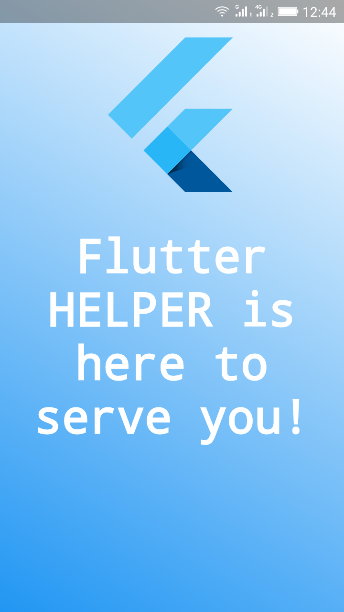
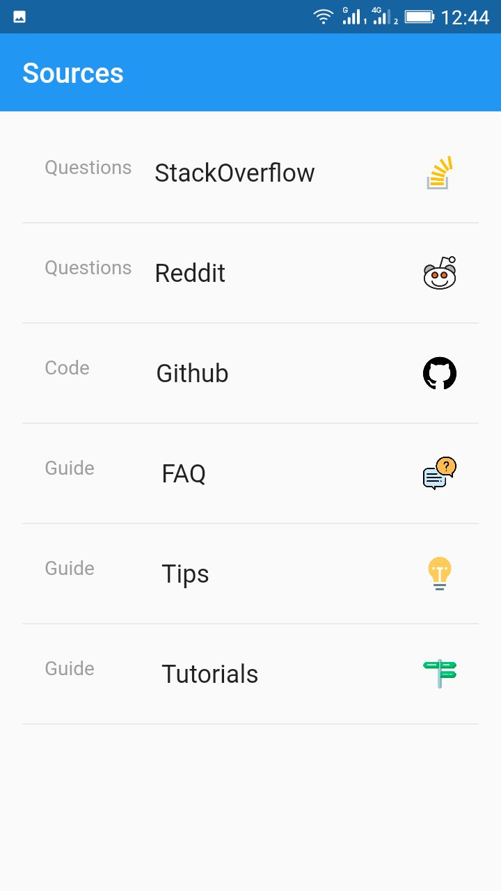
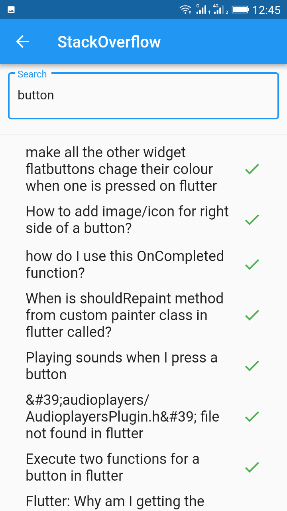
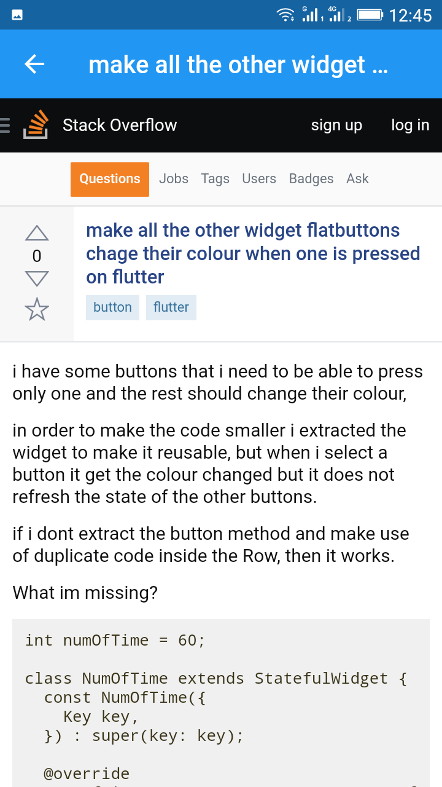
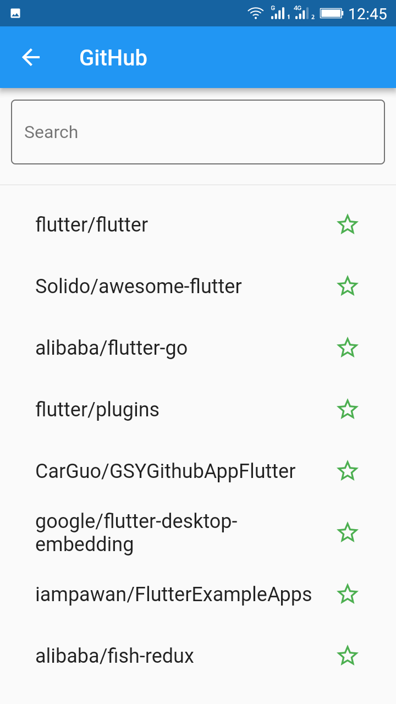
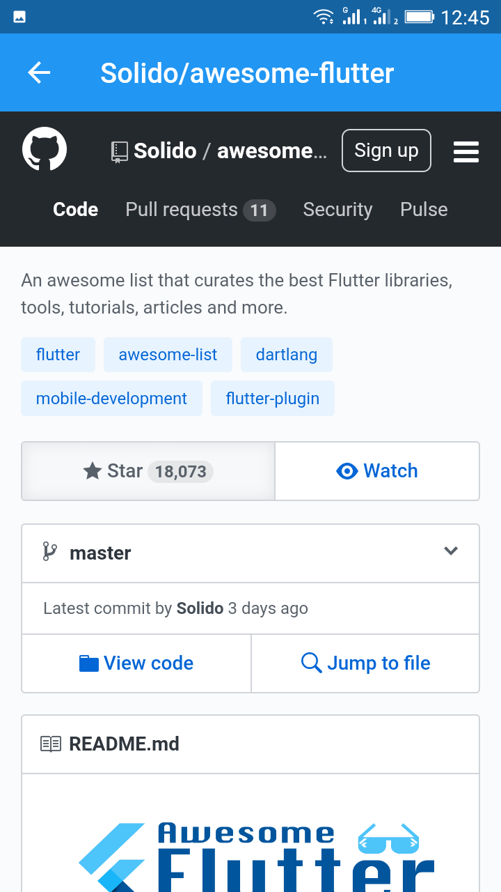

# Flutter HELPER
This app is developed in the [International Flutter Hackathon](https://flutterhackathon.com/), we won the first place in the GDG Ghardaia Hub (Rep. Algeria) the first hub in the hole north Africa. 
##Description:
The most common problem for beginners in flutter is the access to information, the
question is how we can make people learn easier and share knowledge with each
other to extend our community and become more larger,
“Flutter helper”, the idea is about creating a mobile application in flutter which
help the community in the process of learning and developing themselves in Flutter,
so the aim of our project is to collect different sources of information about the
flutter framework and put them in one place which is our App. 

## Tech we used 
- Flutter
- StackOverflow Api
- GitHub Api
- flutter_webview_plugin

Icons credits
https://www.flaticon.com

## Demo

## Getting Started

This project is a starting point for a Flutter application.

A few resources to get you started if this is your first Flutter project:

- [Lab: Write your first Flutter app](https://flutter.io/docs/get-started/codelab)
- [Cookbook: Useful Flutter samples](https://flutter.io/docs/cookbook)

For help getting started with Flutter, view our 
[online documentation](https://flutter.io/docs), which offers tutorials, 
samples, guidance on mobile development, and a full API reference.
